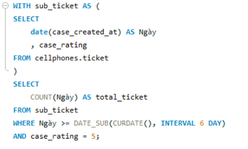
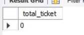
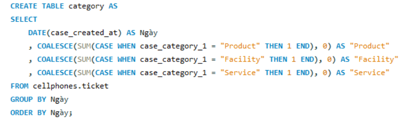
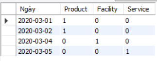
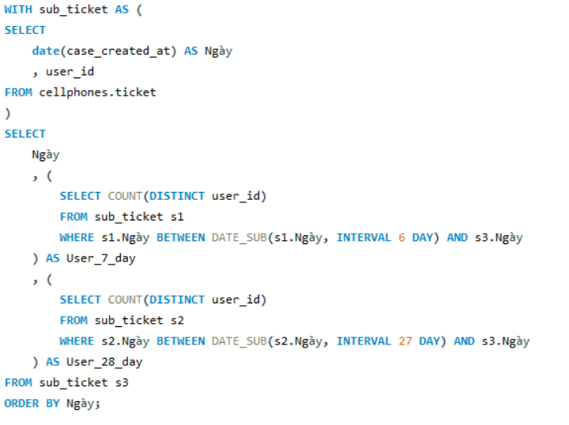

# TECHNOLOGIES
- Database: `MySQL`
- Ngôn ngữ: `SQL`
- Visualization: `Power BI`

# I. SET UP
- Dataset: [ticket.csv](dataset/ticket.csv)
- Tạo dataset `cellphones` và bảng `ticket` trong MySQL server. Insert data từ [ticket.csv](data/raw_data/ticket.csv) vào bảng `ticket`.

# II. EXECUTION
## Task 1: Viết SQL để lấy số ticket của 10 ngày gần nhất, lưu ý rằng có thể có những ngày không có ticket nào
**Script:** [script_1](test_answer/task_1/answer_1.sql)

**Output:** [output_1](test_answer/task_1/output_1.csv)

## Task 2: Viết SQL để đếm số khách hàng có phản hồi 5 sao trong vòng 7 ngày vừa qua, tính từ ngày hôm nay
**Script:** [script_2](test_answer/task_2/answer_2.sql)

**Output:** [output_2](test_answer/task_2/output_2.csv)

## Task 3: Viết SQL để output ra được kết quả như bên dưới , mỗi cell là số lượng ticket của từng category
**Script:** [script_3](test_answer/task_3/answer_3.sql)

**Output:** [output_3](test_answer/task_3/output_3.csv)

- Đáp án và kết quả của task 4: [task_4](test_answer/task_4)
- Đáp án và kết quả của task 5: [task_5](test_answer/task_5)
- Đáp án và kết quả của task 6: [task_6](test_answer/task_6)

## Task 7: Viết SQL biểu diễn tổng số user có feedback trong 7 ngày và 28 ngày, biểu diễn theo từng ngày. Trong đó, từng ngày sẽ cần quét ngược về lịch sử 7 / 28 ngày
**Script:** [script_7](test_answer/task_7/answer_7.sql)

**Output:** [output_7](test_answer/task_7/output_7.csv)

