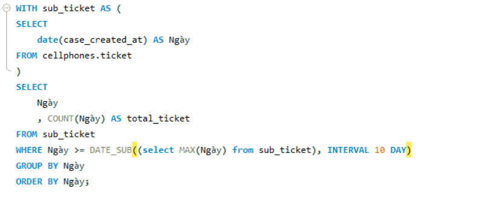
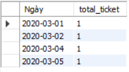

# TECHNOLOGIES
- Database: `MySQL`
- Ngôn ngữ: `SQL`
- Visualization: `Power BI`

# I. SET UP
- Dataset: [ticket.csv](dataset/ticket.csv)
- Tạo dataset `cellphones` và bảng `ticket` trong MySQL server. Insert data từ [ticket.csv](data/raw_data/ticket.csv) vào bảng `ticket`.

# II. EXECUTION
## Task 1: Viết SQL để lấy số ticket của 10 ngày gần nhất, lưu ý rằng có thể có những ngày không có ticket nào
**Script:**

**Output:**

- Đáp án và kết quả của task 2: [task_2](test_answer/task_2)
- Đáp án và kết quả của task 3: [task_3](test_answer/task_3)
- Đáp án và kết quả của task 4: [task_4](test_answer/task_4)
- Đáp án và kết quả của task 5: [task_5](test_answer/task_5)
- Đáp án và kết quả của task 6: [task_6](test_answer/task_6)
- Đáp án và kết quả của task 7: [task_7](test_answer/task_7)
