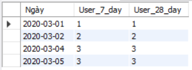

# TECHNOLOGIES
- Database: `MySQL`
- Ngôn ngữ: `SQL`
- Visualization: `Power BI`

# I. SET UP
- Dataset: [ticket.csv](dataset/ticket.csv)
- Tạo dataset `cellphones` và bảng `ticket` trong MySQL server. Insert data từ [ticket.csv](data/raw_data/ticket.csv) vào bảng `ticket`.

# II. EXECUTION
## Task 1: Viết SQL để lấy số ticket của 10 ngày gần nhất, lưu ý rằng có thể có những ngày không có ticket nào
**Script:** [script_1](test_answer/task_1/answer_1.sql)


**Output:** [output_1](test_answer/task_1/output_1.csv)


## Task 2: Viết SQL để đếm số khách hàng có phản hồi 5 sao trong vòng 7 ngày vừa qua, tính từ ngày hôm nay
**Script:** [script_2](test_answer/task_2/answer_2.sql)


**Output:** [output_2](test_answer/task_2/output_2.csv)


## Task 3: Viết SQL để output ra được kết quả như bên dưới , mỗi cell là số lượng ticket của từng category
**Script:** [script_3](test_answer/task_3/answer_3.sql)


**Output:** [output_3](test_answer/task_3/output_3.csv)


## Task 4: Biểu diễn 2 bảng trên thành một số chart (không giới hạn số lượng), với các metrics do bạn tự đề xuất.


## Task 5: Với bảng dữ liệu mẫu về case như trên, hiện tại bảng đang nằm trong một cơ sở dữ liệu vận hành là Postgres hoặc MySQL. Mục tiêu cuối cùng là team Customer Support có thể tự mình vào xem số bằng các công cụ data visualization. Hãy mô tả cách bạn load dữ liệu này lên data warehouse và bạn sẽ model nó như thế nào để đạt được mục đích trên, giả sử công ty đang dùng một 1 hệ thống data warehouse dạng colum stored để chứa bảng này. Bạn có thể dùng bất kì công cụ và ngôn ngữ lập trình nào bạn quen thuộc, chỉ cần mô tả về pipeline, cách làm, nếu được thì có 1 flow diagram mô tả các bước load


## Task 6: Để tối ưu việc truy xuất data của user, đảm bảo tốc độ truy xuất nhanh nhất với chi phí thấp nhất có thể, bạn sẽ làm gì thêm với model của mình ở câu 5 sau khi đã load lên data warehouse? Hãy đề xuất những cách tối ưu bạn có thể nghĩ tới.
```
Những cách cải thiện model để tối ưu hóa việc truy xuất data:
1. Database indexing:
+ Tạo B-tree index cho những cột thường xuyên dùng trong WHERE clause và JOIN clause của câu query (case_created_at, case_category_1,...)
+ Tạo index sẽ khiến cho việc định vị và truy xuất data nhanh hơn, tuy nhiên cũng nên lưu ý vì nếu tạo quá nhiều index sẽ làm chậm các tác vụ INSERT, UPDATE, và DELETE

2. Normalization:
+ Tách bảng ticket ra thành các bảng fact và dim, các bảng này sẽ kết nối với nhau bằng foreign key và primary key
+ Việc này loại bỏ các data bị lỗi, trùng lặp, không nhất quán,...giúp data trở nên tinh gọn hơn

3. Bảo trì:
+ Thực hiện bảo trì định kì và sửa chữa các bảng trong trong database, cân nhắc loại bỏ các data không cần thiết
```

## Task 7: Viết SQL biểu diễn tổng số user có feedback trong 7 ngày và 28 ngày, biểu diễn theo từng ngày. Trong đó, từng ngày sẽ cần quét ngược về lịch sử 7 / 28 ngày
**Script:** [script_7](test_answer/task_7/answer_7.sql)


**Output:** [output_7](test_answer/task_7/output_7.csv)


